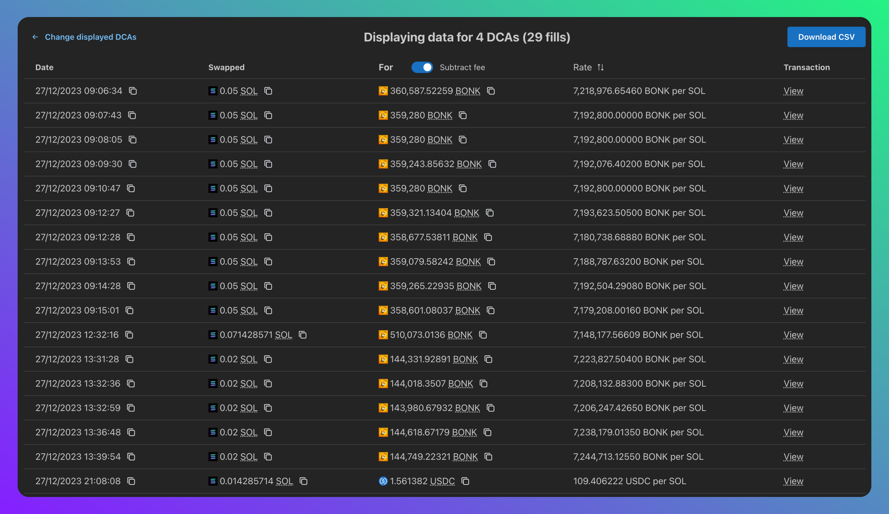

# Jupalyse

Jupiter DCAs are awesome, but it can be difficult to keep track of them and they can be a nightmare at tax time!

Jupalyse is a simple tool to help you keep track of your Jupiter DCAs.



## Features

- View all Jupiter DCAs for any address
- View all trades in an interactive table
- Download a CSV with the data in a format your tax person probably won't hate
- Private: Runs entirely locally, your data is never sent anywhere

## Try it out

Visit https://jupalyse.vercel.app to get started.

## Running locally

```sh
npm install
npm run dev
```

## Shout outs

- [Jupiter](https://jup.ag) for the DCA API (and DCA!)
- [Solflare](https://github.com/solflare-wallet/utl-api) for their awesome token API!

## Tech stuff

- Built with [React](https://react.dev) + [React Router](https://reactrouter.com)
- UI components from [Mantine](https://mantine.dev)

## License

MIT
